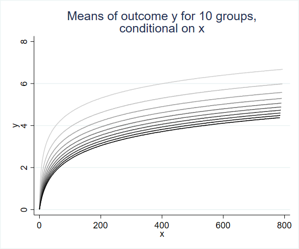
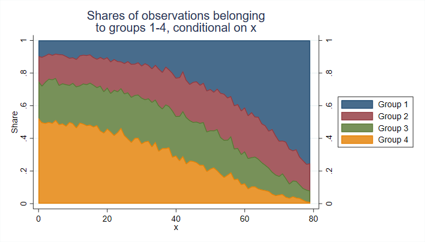
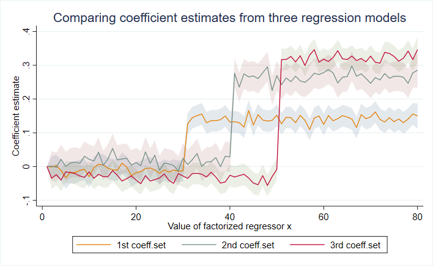

# Statapack

this is a collection of custom Stata programs that I use on a regular basis:

    EST_ADD
    EST_REPLACE
    PLOTAREA
    PLOTB 
    PLOTMEANS
    PLOTTABS
    TICTOC

The PLOT family of commands is particularly useful for visual analyses of admin data, enabling users to produce a variety of highly customizable plots **in a fraction of time and memory required by native Stata commands**:  
1. PLOTTABS plots conditional frequencies of observations (e.g., numbers of people observed each time)
2. PLOTTABS also plots conditional shares of binary variables (e.g., employment shares over time)
3. PLOTMEANS plots conditional means of any variables (e.g., average wages over time)
4. PLOTAREA plots conditional shares of categorical variables (e.g., industry shares over time)
5. PLOTB plots coefficient estimates of explanatory variables

Apart from speed and memory gains, the key advantage of PLOT commands is that they allow the user to **store multiple graphs in memory and overlay them into a single plot**, facilitating comparisons across groups and models. For example, you can use these commands to visualize whether labor participation dynamics of women differ from those of men, or whether the magnitudes of your coefficient estimates differ between your candidate model specifications. To use the PLOT commands, simply execute the respective do-files in the Stata command line (or paste them into the preamble of your code). The examples below illustrate the workflow of all PLOT commands, and the dofiles contain more information about the commands and their options.  

Note: PLOT commands **only work with Stata 16 and above** because they leverage frame structures. These structures are essential for speed and memory gains, and they store all graph data. Should you wish to access (and adjust) this stored graph data, you can find it in the frame called 
    frame_pt

Please also note that all these commands are a work in progress. The degree of customization differs from command to command, and bugs may appear. 
If you encounter an error, feel free to get in touch with a working example that demonstrates the error. 
If you like these commands and would like to help with converting them into proper .ado Stata routines with help files and all that, please get in touch. 

## Example 1: Conditional frequencies with PLOTTABS

This example is equivalent to merging two histograms with discrete bin widths and option *freq*:
 
 

Code:

    webuse set https://www.jankabatek.com/datasets/
    webuse plotdata, clear
    qui do https://raw.githubusercontent.com/jankabatek/statapack/master/PLOTTABS.do
    // first histogram (gr=1), option clear erases previous PLOT data from the memory
    PLOTTABS if gr==1, over(x1) clear 
    // second histogram (gr=2), specify the visualization options: graph() type, overall twoway options() & graph-specific groptions() 
    PLOTTABS if gr==2, over(x1) graph(bar) options(title("Frequencies of observations, conditional on x") xtitle("x") ytitle("Frequency") legend(on order(1 "Group 1" 2 "Group 2")) xsize(7))  groptions(color(%50))

## Example 2: Conditional means with PLOTMEANS

This example plots conditional means of variable *y* (*x* is the conditioning variable) for ten groups of observations.
 
 

Code:

    webuse set https://www.jankabatek.com/datasets/
    webuse plotdata, clear
    qui do https://raw.githubusercontent.com/jankabatek/statapack/master/PLOTMEANS.do
    // conditional means for the first group (gr10=1), option clear erases previous PLOT data from the memory
    PLOTMEANS y if gr10 ==1, over(x2) clear
    // conditional means for the other groups, specify the twoway options & graph options
    forvalues g = 2/10{
        PLOTMEANS y if gr10 ==`g', over(x2) gray opt(legend(off) ytitle(y) xtitle(x) title("Means of outcome y for `g' groups," "conditional on x") xsize(6))
    }

## Example 3: Stacked conditional shares with PLOTAREA

This example plots how many observations belong to each of four mutually exclusive groups of observations, conditional on a specific value of *x*.
 
 

Code:

    webuse set https://www.jankabatek.com/datasets/
    webuse plotdata, clear
    qui do https://raw.githubusercontent.com/jankabatek/statapack/master/PLOTAREA.do
    PLOTAREA gr4, over(x3) opt(title("Shares of observations belonging"  "to groups 1-4, conditional on x") xtitle("x") ytitle("Share") legend(on rows(4) pos(3) order(1 "Group 1" 2 "Group 2" 3 "Group 3" 4 "Group 4")) xsize(7))

## Example 4: Multiple sets of coefficient estimates with PLOTB

This example plots coefficient estimates and 95% confidence intervals corresponding to a factorized regressor *x* from three separate regressions. 
 
 

Code:

    webuse set https://www.jankabatek.com/datasets/
    webuse plotdata, clear
    qui do https://raw.githubusercontent.com/jankabatek/statapack/master/PLOTB.do
    // regression model 1
    reg z1 i.x3
    PLOTB i.x3, clear 
    // regression model 2
    reg z2 i.x3
    PLOTB i.x3
    // regression model 3
    reg z3 i.x3
    PLOTB i.x3, opt(title(Comparing coefficient estimates from three regression models) xtitle("Value of factorized regressor x") ytitle("Coefficient estimate") legend(on rows(1) order(4 "1st coeff.set" 5 "2nd coeff.set" 6 "3rd coeff.set")) xsize(6.5))
    
    
## Additional examples of graphs made with PLOT commands:    
